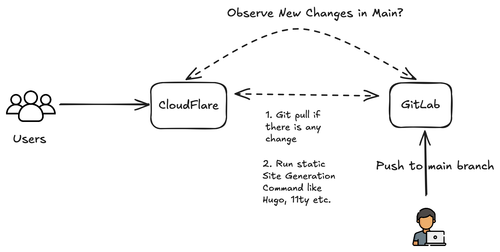

+++
title = "Host Your Static Website for Free – No Hidden Costs!"
date = 2025-03-06T07:07:07+01:00
draft = false
author = "Safique A Faruque"
description = "Learn how to host your static website for free using Cloudflare Pages, GitHub Pages, GitLab Pages, and Vercel. Step-by-step guide with no hidden costs!"
tags = ["free website hosting", "static site hosting", "deploy website for free", "Cloudflare Pages", "GitHub Pages", "GitLab Pages", "Vercel"]
categories = ["Web Development", "Hosting", "Static Sites"]
keywords = ["free hosting platforms", "best static site hosting", "GitHub Pages tutorial", "Vercel vs Cloudflare Pages"]
slug = "free-static-website-hosting"
image = "images/diagram.png"
canonicalURL = "https://devmlops.com/free-static-website-hosting"
+++

Want to get your website online without spending a dime? Platforms like Cloudflare Pages, GitHub Pages, and Vercel make it easier than ever to host your site for free. In this guide, you'll learn how to set up your website quickly and effortlessly — no hidden fees, no hassle!

---

## Cloudflare Pages
Cloudflare Pages is a great option for deploying static sites with a global CDN.
<!--more-->


### Steps to Deploy
1. Create a Cloudflare account at [Cloudflare Pages](https://pages.cloudflare.com/).
2. Connect your GitHub or GitLab repository.
3. Select the repository containing your site.
4. Configure the build settings if you use any static site generator (for example, use `npm run build` for Next.js or `hugo` for Hugo sites).
5. Click deploy and wait for the build to complete.
6. Your site will be live with a Cloudflare-provided subdomain.

---

## GitHub Pages
GitHub Pages is ideal for hosting static sites directly from a GitHub repository.

### Steps to Deploy
1. Create a GitHub repository and push your website files.
2. Go to the repository settings.
3. Scroll to the **GitHub Pages** section.
4. Select the branch you want to use for deployment (`main` or `gh-pages`).
5. Save the settings and GitHub will generate a live link for your site.

---

## GitLab Pages
GitLab Pages offers free hosting for static sites with GitLab CI/CD.

### Steps to Deploy
1. Create a GitLab repository and push your website files.
2. Add a `.gitlab-ci.yml` file to configure GitLab CI/CD:
   ```yaml
   image: node:latest
   pages:
     script:
       - npm install
       - npm run build
     artifacts:
       paths:
         - public
   ```
3. Commit and push the changes.
4. GitLab will deploy your site and provide a live URL.

---

## Vercel
Vercel is a great option for hosting static and frontend frameworks like Next.js.

### Steps to Deploy
1. Sign up at [Vercel](https://vercel.com/) using GitHub, GitLab, or Bitbucket.
2. Import your repository and configure the build settings.
3. Click deploy and wait for the process to complete.
4. Vercel will generate a live preview link and provide a custom domain option.

Each of these platforms provides a reliable way to host your website for free. Whether you choose Cloudflare Pages for its global CDN, GitHub Pages for its simplicity, GitLab Pages for CI/CD integration, or Vercel for frontend optimization, you can easily get your site online without spending a dime.


