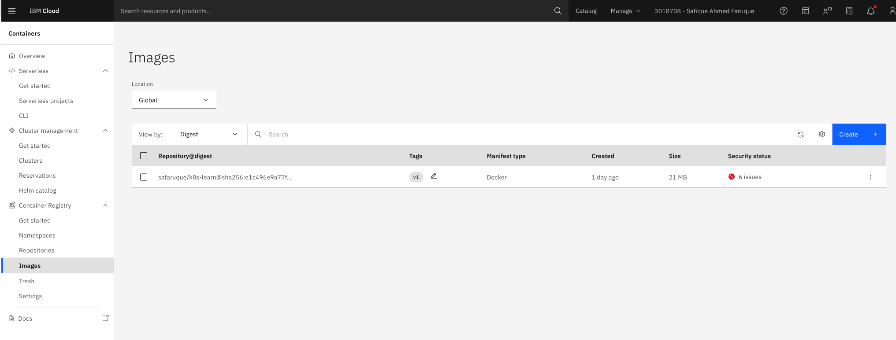
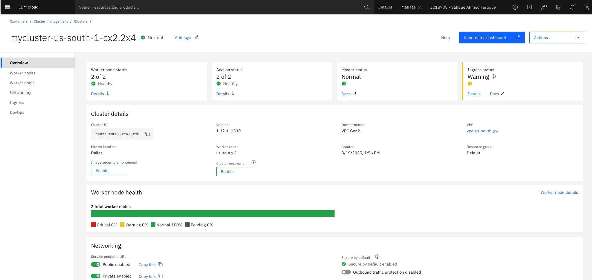
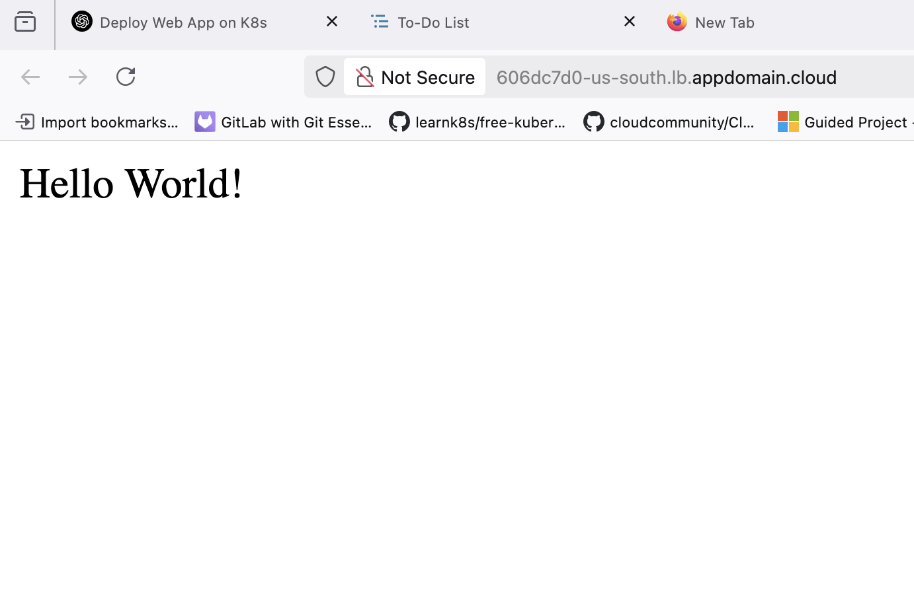

+++
title = "Simplest Way to Deploy a Web App on Kubernetes (K8s)"
author = "Safique A Faruque"
date = "2025-03-21"
description = "A simple two-step guide to deploying a web app on Kubernetes using IBM Cloud."
tags = ["Kubernetes", "Deployment", "Web App", "Cloud", "k8s"]
categories = ["Tutorial", "Kubernetes"]
draft = false
+++

If you’re looking to quickly deploy a web app and make it accessible via a URL on Kubernetes (K8s), the process can be incredibly simple. In just two easy steps, you’ll have your app up and running. Here’s a quick guide on how to do it.

<!--more-->

#### **Step 1: Deploy the App**

To get started, you’ll need two things:

1. **An Image of Your App in a Public Container Registry**  
   Before you deploy your app, make sure you have a container image of your web app stored in a public container registry (like Docker Hub, Google Container Registry, or IBM Cloud Container Registry).


2. **A Kubernetes Cluster**  
   You’ll need an existing Kubernetes cluster where you’ll deploy your app. If you don’t have a cluster yet, services like IBM Cloud, AWS, or GCP offer easy ways to create and manage Kubernetes clusters.


Once you’ve got these prerequisites, you can deploy your app using the following command:

```bash
kubectl apply -f deployment.yaml
This command tells Kubernetes to deploy your app as defined in the deployment.yaml file, which should include information about the container image and how to run it within the cluster.
```
#### **Step 2: Expose Your App as a Service**
Now that your app is running inside your Kubernetes cluster, the next step is to expose it so it can be accessed from the web.
Use the following command to expose your app as a service:
```
kubectl expose deployment my-app --type=LoadBalancer --name=my-service
```
This will create a service named my-service that makes your app accessible via a public IP (or load balancer, depending on your cluster setup). Once the service is created, you can access your app through the URL or IP provided by the load balancer.



With just these two steps — deploying your app and exposing it as a service — you can easily get your web app running on Kubernetes and accessible via a URL. Whether you're using IBM Cloud or any other cloud provider, this method is quick and effective for quickly testing or deploying simple applications.
Now, your app is live and accessible for anyone with the right URL!

This simplified method provides the foundation for deploying web apps on Kubernetes. As you grow your application, you can add more configurations like scaling, monitoring, and security, but this guide will help you get started with the basics.
